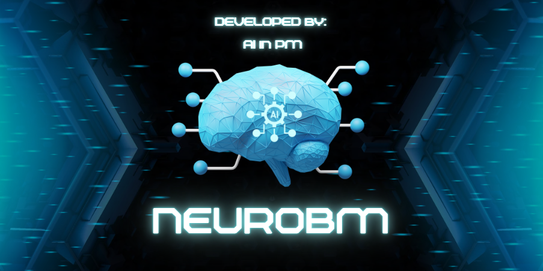

# NeuroBM: Neural Boltzmann Machines for Cognitive Modeling

**A research platform for cognitive modeling using energy-based neural networks**



[](https://www.python.org/downloads/)
[](https://opensource.org/licenses/Apache-2.0)
[](https://github.com/psf/black)

**Owner**: Darrell Mesa (darrell.mesa@pm-ss.org)

**GitHub**: https://github.com/ai-in-pm

**Repository**: https://github.com/ai-in-pm/NeuroBM

NeuroBM is a research and educational platform for cognitive modeling using Boltzmann machines. It provides a framework for exploring cognitive dynamics, hypothesis generation, and understanding human-technology interaction patterns. It is only to be used to study how the Human Brain works as technology is all around us in 2025 and onwards.

⚠️ **IMPORTANT**: This is for educational and hypothesis-generation purposes only.
**No diagnosis, risk prediction, or treatment advice.**

**Special Thank You to Steven Bartlett**

Your video gave me the opportunity to build my own Neuro Boltzmann Machine as a way to study how my brain works living with PTSD, while also exploring how my seven-year-old son—who has autism—experiences and processes the world. As a Professional Project Manager, I see technology not only reshaping how we manage complex projects but also how it integrates into our personal lives.

This video was more than just content—it became a catalyst for innovation, reflection, and a deeply personal project. Grateful that you continue to share ideas that ripple far beyond the screen.

**Video**: "Brain Experts WARNING: Watch This Before Using ChatGPT Again! (Shocking New Discovery)"
**Link**: https://www.youtube.com/watch?v=5wXlmlIXJOI

---

## 🧠 What is NeuroBM?

NeuroBM is a research framework for exploring cognitive dynamics using Boltzmann machines. It provides:

- **Statistical Foundations**: Energy functions, partition function estimation, and likelihood computation
- **Educational Focus**: Clear documentation, ethical guidelines, and interpretability tools
- **Research Scenarios**: Pre-configured setups for studying general cognition, PTSD, autism, and technology-reliance patterns
- **Production-Ready Code**: Testing, automated scaffolding, and modular design

### 🎯 **Core Features**

### 🔬 **Model Types**
- **Restricted Boltzmann Machines (RBM)**: Binary and Gaussian visible units
- **Deep Boltzmann Machines (DBM)**: Multi-layer architectures with pre-training
- **Conditional RBMs (CRBM)**: Time-series and conditional modeling

### 🎯 **Training Infrastructure**
- **Algorithms**: Contrastive Divergence (CD-k), Persistent CD (PCD)
- **Likelihood Estimation**: Annealed Importance Sampling (AIS) with diagnostic tools
- **Training Loops**: Callbacks, early stopping, checkpointing, mixed precision

### 🔍 **Interpretability Tools**
- **Saliency Analysis**: Weight importance, feature attribution, connection strength
- **Mutual Information**: Information flow analysis between layers
- **Latent Traversals**: Direction discovery, counterfactual analysis
- **Visualization Tools**: Weight matrices, feature importance, traversal paths

### 📊 **Data & Scenarios**
- **Synthetic Data Generation**: Realistic correlations and population heterogeneity
- **Research Regimes**:
  - **Base**: General cognitive features (attention, working memory, stress)
  - **PTSD**: Hyperarousal, avoidance, intrusive thoughts, sleep disruption
  - **Autism**: Sensory sensitivity, routine adherence, focused interests
  - **Technology-Reliance**: Effort avoidance, automation expectation, frustration tolerance
  - **PTSD-PM**: PTSD-affected project managers with technology integration dynamics
- **Data Transformations**: Normalization, binarization, noise injection

### 🤖 **Automation System**
- **Research Monitoring**: Weekly scanning of research developments
- **Integration Pipeline**: Automated evaluation and integration of relevant updates
- **Version Management**: Semantic versioning with automated releases
- **Deployment**: Multi-stage deployment with quality gates

---

## 🚀 Quick Start

### Installation

```bash
# Clone the repository
git clone https://github.com/ai-in-pm/NeuroBM.git
cd NeuroBM

# Install dependencies
pip install -e .

# Verify installation
python test_neurobm_core.py
```

### Basic Usage

```python
from neurobm.models.rbm import RestrictedBoltzmannMachine
from neurobm.data.synth import SyntheticDataGenerator

# Generate synthetic cognitive data
generator = SyntheticDataGenerator("base", random_seed=42)
data = generator.generate(n_samples=1000)

# Train RBM
rbm = RestrictedBoltzmannMachine(n_visible=5, n_hidden=128)
rbm.fit(data, epochs=100)

# Analyze results
from neurobm.interpret.saliency import SaliencyAnalyzer
analyzer = SaliencyAnalyzer(rbm)
importance = analyzer.feature_importance(data)
print("Feature importance:", importance)
```

### Command Line Interface

```bash
# Train a model
python scripts/train.py --regime=base --model=rbm --epochs=100

# Generate samples
python scripts/sample.py --checkpoint=runs/base/best.ckpt --n_samples=100

# Run interpretability analysis
python scripts/analyze.py --checkpoint=runs/base/best.ckpt --data=test_data.pt

# Launch interactive dashboards
python dashboards/launch_dashboards.py
```

---

## 📁 Project Structure

```
NeuroBM/
├── neurobm/                    # Core package
│   ├── models/                 # Model implementations
│   │   ├── rbm.py             # Restricted Boltzmann Machine
│   │   ├── dbm.py             # Deep Boltzmann Machine
│   │   └── crbm.py            # Conditional RBM
│   ├── data/                  # Data handling
│   │   ├── synth.py           # Synthetic data generation
│   │   └── schema.py          # Data schemas and validation
│   ├── training/              # Training infrastructure
│   │   ├── trainer.py         # Training loops
│   │   ├── callbacks.py       # Training callbacks
│   │   └── evaluation.py      # Model evaluation
│   └── interpret/             # Interpretability tools
│       ├── saliency.py        # Saliency analysis
│       ├── mutual_info.py     # Mutual information
│       └── latent.py          # Latent space analysis
├── experiments/               # Experiment configurations
│   ├── base.yaml             # Base cognitive regime
│   ├── ptsd.yaml             # PTSD-related patterns
│   ├── autism.yaml           # Autism spectrum features
│   └── ptsd_pm.yaml          # PTSD project manager scenario
├── dashboards/               # Interactive dashboards
│   ├── training_monitor.py   # Real-time training monitoring
│   ├── model_explorer.py     # Model exploration interface
│   └── results_analyzer.py   # Results analysis dashboard
├── automation/               # Automation system
│   ├── research_monitor.py   # Research development tracking
│   ├── integration_pipeline.py # Automated integration
│   ├── version_manager.py    # Version and release management
│   └── deployment_manager.py # Deployment automation
├── notebooks/                # Educational notebooks
│   ├── 01_theory_primer.ipynb # Boltzmann machine theory
│   ├── 02_base_latents.ipynb # Base cognitive modeling
│   └── 07_comprehensive_tutorial.ipynb # Complete tutorial
├── scripts/                  # Command-line tools
│   ├── train.py              # Training script
│   ├── sample.py             # Sampling script
│   └── eval_ais.py           # AIS evaluation
├── docs/                     # Documentation
│   ├── ethics_guidelines.md  # Ethical guidelines
│   ├── model_cards/          # Model documentation
│   └── data_cards/           # Data documentation
└── tests/                    # Test suite
    ├── test_models.py        # Model tests
    └── test_data.py          # Data generation tests
```

---

## 🧬 Cognitive Scenarios

### Base Cognitive Features
- **Attention Span**: Sustained attention capacity
- **Working Memory**: Temporary information storage
- **Novelty Seeking**: Openness to new experiences
- **Sleep Quality**: Sleep patterns and quality
- **Stress Index**: General stress levels

### PTSD-Related Patterns
- **Hyperarousal**: Heightened alertness and reactivity
- **Avoidance**: Tendency to avoid triggers
- **Intrusive Thoughts**: Unwanted recurring thoughts
- **Sleep Disruption**: Sleep quality and patterns
- **Emotional Numbing**: Reduced emotional responsiveness

### Autism Spectrum Features
- **Sensory Sensitivity**: Response to sensory input
- **Routine Adherence**: Preference for predictable patterns
- **Focused Interests**: Intensity of special interests
- **Social Communication**: Communication preferences
- **Change Tolerance**: Adaptability to changes

### Technology-Reliance Dynamics
- **Effort Cost**: Perceived mental effort cost
- **Ambiguity Tolerance**: Tolerance for uncertainty
- **Reward Sensitivity**: Sensitivity to timing delays
- **Automation Expectation**: Expectation of automated assistance
- **Frustration Tolerance**: Tolerance for setbacks

### PTSD-PM Technology Integration
- **Hypervigilance**: Heightened alertness and scanning
- **Cognitive Load**: Mental effort and processing capacity
- **Tech Tool Mandate**: Organizational pressure to use technology tools
- **Frustration Tolerance**: Tolerance for technology limitations
- **Avoidance Behavior**: Tendency to avoid challenging tasks
- **Tech Tool Adoption Resistance**: Resistance to new technology tools in workflow
- **Tech Tool Acceptance**: Comfort with technology tool integration

This scenario models the intersection of PTSD symptoms with project management cognitive demands, exploring how technology tools (from 2025 onwards) impact work performance, stress responses, and decision-making processes in certified Project Management Professionals.

**Research Context**:
- **Synthetic data only** - no real patient information
- **Educational purpose** - to understand potential technology impacts and inform supportive tool design
- **Hypothesis generation** - for future research directions

---

## 🧪 Testing

Run the test suite:

```bash
# Core functionality tests
python test_neurobm_core.py

# Model-specific tests
python test_neurobm_models.py

# Data generation tests
python test_neurobm_data.py

# Full test suite
python test_neurobm_comprehensive.py

# Automation system tests
python automation/test_automation_system.py
```

---

## ⚖️ Ethics & Responsible Use

### ✅ **Designed For:**
- Educational exploration of cognitive dynamics
- Hypothesis generation and testing
- Research into human-technology interaction patterns
- Understanding statistical relationships in synthetic data

### ❌ **NOT For:**
- Clinical diagnosis or assessment
- Risk prediction or screening
- Treatment recommendations
- Real-world decision making about individuals

### 🔒 **Safety Measures:**
- **Synthetic Data Only**: No real patient or personal data
- **Educational Focus**: Clear documentation of limitations
- **Ethical Guidelines**: Built-in responsible use framework
- **Transparency**: Open source with full documentation

### 📋 **Compliance:**
- Research ethics guidelines
- Data protection principles
- Educational use standards
- Responsible technology development

---

## 🤝 Contributing

We welcome contributions! Please see our contributing guidelines and code of conduct.

### Development Setup

```bash
# Clone and install in development mode
git clone https://github.com/ai-in-pm/NeuroBM.git
cd NeuroBM
pip install -e ".[dev]"

# Run tests
python -m pytest tests/

# Format code
black neurobm/ tests/
```

---

## 📚 Documentation

- **Getting Started**: See `notebooks/07_comprehensive_tutorial.ipynb`
- **API Reference**: Generated from docstrings
- **Model Cards**: `docs/model_cards/`
- **Ethics Guidelines**: `docs/ethics_guidelines.md`
- **Research Framework**: `docs/responsible_ai_framework.md`

---

## 🙏 Acknowledgments

This framework builds upon decades of research in:
- Boltzmann machines and energy-based models
- Cognitive science and computational neuroscience
- Model interpretability and analysis
- Responsible technology development

---

*This project was inspired by Steven Bartlett's video on brain experts and technology interaction. The personal journey of understanding PTSD and autism through computational modeling reflects the intersection of technology, neuroscience, and human experience.*
